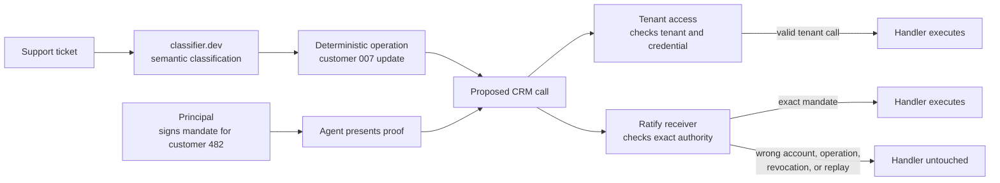

# classifier.dev × Ratify Protocol

An executable reference for the boundary between semantic routing and delegated authority.

classifier.dev tells an agent what a request is. Ratify lets the system carrying the consequence verify what that agent was authorized to do next.

**Status:** open-source independent reference implementation. This is not a
classifier.dev partnership, endorsement, or official reference architecture.

## Start here

This lab is an interactive comparison, not a hosted product signup. It shows
what changes when a classifier's proposed action reaches two different
receivers:

1. Run the lab locally with the commands below.
2. Choose **Wrong account** and click **Run selected case**.
3. Read the two results: ordinary tenant access executes the update for valid
   customer 007, while the Ratify receiver stops it because the signed mandate
   is for customer 482.
4. Choose **Exact mandate** and run it again. Both receivers allow the call.
5. Try the remaining cases to see operation mismatch, replay, and revocation.

The lesson is simple: classification proposes an action; the receiver that
owns the side effect decides whether that exact action is authorized.

## What this reference uses

This repository uses [`@identities-ai/ratify-protocol`](https://github.com/identities-ai/ratify-protocol)
directly. The protocol SDK issues the demo delegation, signs the presentation,
binds the proof to the proposed operation, and verifies it offline in the
receiver. The package version is pinned in `package.json` so the executable
example has a known protocol surface.

It does **not** use
[`@identities-ai/ratify-receiver`](https://github.com/identities-ai/ratify-receiver).
That is a separate TypeScript helper for a server that chooses the managed
Ratify Verify service and wants a guarded handler API. This lab is intentionally
an open, self-contained protocol reference: `src/demo-session.ts` implements
the demonstrator receiver with a SQLite-backed challenge store, exact operation
binding, expiry, revocation, trusted-principal checks, and single-use replay
protection. A production TypeScript service can choose the receiver helper when
it wants that managed Verify integration; the two projects are complementary,
not interchangeable.

The concrete boundary: classifier.dev can route an ambiguous support request to
customer 007, and tenant access can execute because 007 is a valid Acme
customer. Ratify stops the same call because the signed mandate names customer
482.

## The problem

Classification is safe to offer without login because it produces a belief, not a side effect. The trust boundary appears after that result becomes a tool call.

A tenant-scoped credential can prove that an agent may reach a CRM and update customers in the Acme tenant. It does not carry the narrower fact that a principal authorized this agent to write only customer 482's billing address for ten minutes. Ratify additionally binds the presented proof to the exact proposed call and lets the receiver accept its challenge once.

This reference makes that difference visible. The same classifier-driven call goes to two competent receivers:

| Receiver | What it checks | What happens when an ambiguous account resolver chooses customer 007 |
| --- | --- | --- |
| Tenant access | Authentication, tenant, credential scope, object shape | Executes because 007 is a valid Acme customer |
| Ratify authority | All receiver controls plus trusted principal, agent, exact scope, resource path, operation binding, expiry, revocation, and single use | Stops because the signed mandate names customer 482 |

Ratify does not prove that classifier.dev is correct. It gives the receiver a cryptographic basis to allow or stop the action classification caused.



The two lanes receive the same proposed call. The first answers “can this
credential reach the tenant?” The second answers “did this principal authorize
this agent to perform this exact operation on this exact resource, now, and
only once?”

## Run it locally

Requirements: Node.js 22.13 or newer.

```bash
npm ci
cp .dev.vars.example .dev.vars
npm run dev
```

Open the local URL Vite prints. classifier.dev does not require an API key. `CLASSIFIER_API_KEY` is optional and only supports a partner or operator quota if one is provided.

The local demo uses public, fixed test identities. They are intentionally not secrets and must never be used outside this reference.

## What each part does

| Part | Responsibility | What it does not decide |
| --- | --- | --- |
| classifier.dev | Classifies the support ticket and returns an action label with confidence | Whether the action is authorized |
| Application mapping | Converts the label into a typed, deterministic operation and resource path | Whether the classifier chose correctly |
| Tenant access lane | Demonstrates ordinary authenticated tenant access | Exact principal mandate, replay, or revocation |
| Ratify protocol lane | Verifies the signed delegation, challenge, scope, path, operation, expiry, revocation, and freshness | Whether the business request itself is desirable |
| Protected handler | Performs the simulated CRM update only after the receiver allows | Any authorization that happens after the side effect |

## Run the executable gate

```bash
npm ci
npm run check
```

The gate regenerates and checks Cloudflare bindings, type-checks the Worker and browser client, runs five Durable Object integration cases in the Workers runtime, and builds the production bundle. No test is skipped.

The cases encode the business boundary:

- exact mandate: both receivers execute;
- wrong account: tenant access executes, exact authority stops;
- different operation: classifier.dev proposes a read, while the mandate grants one write;
- copied request: bearer access executes twice, the receiver challenge is consumed once;
- revoked authority: tenant access remains valid, the Ratify receiver stops.

## How the integration works

1. Before classification, the principal issues a short-lived `data:write` delegation to the support agent for `crm:tenant/acme/customers/482/billing-address`.
2. The Worker sends the ticket to classifier.dev's multidimensional `POST /v1/classify` API. The returned action label is not cosmetic: it selects the canonical operation and required Ratify scope.
3. Deterministic application code resolves the customer and constructs the proposed call. The model is not used for parsing, routing tables, retries, or authorization.
4. The receiving Durable Object issues an operation-bound, single-use challenge.
5. The agent presents the signed delegation and challenge response.
6. The receiver reconstructs the operation, pins the accepted principal, verifies the proof, atomically consumes the challenge, and reaches the protected handler only on allow.

```mermaid
sequenceDiagram
    participant P as Principal
    participant A as Agent
    participant C as classifier.dev
    participant R as CRM receiver
    participant H as Protected handler
    P->>A: Signed customer 482 write mandate
    A->>C: Classify support ticket
    C-->>A: update customer plus confidence
    A->>R: Proposed call
    R-->>A: Operation-bound challenge
    A->>R: Delegation proof plus signed challenge
    R->>R: Verify trusted root, scope, path, payload, expiry, revocation, freshness
    alt exact authority verified
        R->>H: Execute once
    else any check fails
        R-->>A: Stop; handler untouched
    end
```

## How to incorporate Ratify

Keep classifier.dev (or any other classifier) on the belief side of the boundary. Add Ratify at the receiver that owns the consequence:

1. Issue a Ratify delegation from the accountable principal to the agent. Put the narrow resource path, scope, expiry, and any application limits in the certificate.
2. Let the agent call the classifier and map its label to a typed operation with deterministic application code.
3. Have the receiver issue a fresh challenge and reconstruct the operation and payload digest itself. Do not let the model or caller choose the trust root or final scope.
4. Call `verifyBundle` with the receiver's trusted root, required scope, resource context, revocation provider, and durable `ChallengeStore`. Invoke the protected handler only when it returns valid.

The smallest receiver decision looks like this:

```ts
const decision = await verifyBundle(proofBundle, {
  required_scope: proposed.requiredScope,
  session_context: receiverSessionContext,
  context: {
    has_resource: true,
    requested_resource_id: proposed.resourceId,
    requested_path: proposed.path,
  },
  challenge_store: durableChallengeStore,
  revocation: receiverRevocationProvider,
});

if (!decision.valid || decision.human_id !== trustedPrincipalId) {
  return denyWithoutCallingTheHandler();
}
return protectedHandler(proposed);
```

This reference is the code developers can fork: the Cloudflare Worker boundary in `src/worker.ts`, the SQLite-backed receiver state in `src/demo-session.ts`, operation binding in `src/operation.ts`, and the browser comparison in `web/`. The Ratify SDK remains the portable protocol dependency. A production integration replaces the public demo identities, simulated issuer, deterministic fixture directory, and local revocation callback with its own principal identity, policy, data store, and audit system.

For teams that want a managed trust, revocation, replay, audit, and availability layer instead of operating those pieces, the next step is the [Ratify Verify design-partner path](https://ratifyprotocol.com/#partners).

## Code map

| File | Responsibility |
| --- | --- |
| `src/classifier.ts` | Bounded classifier.dev request and strict response validation |
| `src/operation.ts` | Deterministic label-to-operation mapping and operation binding |
| `src/authority.ts` | Demo principal, agent, and exact delegation issuance |
| `src/demo-session.ts` | Durable challenge store, trusted-root verification, and protected counters |
| `src/access.ts` | Competent tenant-access comparison lane |
| `src/worker.ts` | Closed Labs origin, input bounds, privacy-preserving rate limit, and API |
| `web/` | Interactive side-by-side visualization |
| `test/worker.test.ts` | Allow and adversarial receiver outcomes in the Workers runtime |

## Cloudflare deployment

The application is one Cloudflare Worker with static assets and two SQLite-backed Durable Object classes. It is designed to sit behind the closed router at `labs.ratifyprotocol.com/classifier-dev`.

Production requires these Worker secrets:

- `LABS_ROUTER_TOKEN`: shared only with the Labs router; direct origin requests fail closed;
- `PRIVACY_SALT`: keys day-scoped caller pseudonyms used by the demo rate limiter.

`CLASSIFIER_API_KEY` is optional. Set secrets interactively; never put values on a command line or commit `.dev.vars`.

```bash
npx wrangler secret put LABS_ROUTER_TOKEN
npx wrangler secret put PRIVACY_SALT
npm run check
npx wrangler deploy --dry-run
```

Deployment is intentionally separate from Labs routing. Do not add the public Labs route until the source repository is public, the protocol profile is merged, the executable gate is green, and the origin has been independently verified to fail closed.

The checked-in local run record is [`evidence/reference-evidence.md`](evidence/reference-evidence.md).

## Open reference and Ratify Verify

Use this open-source reference to inspect and adapt the authority boundary yourself. It has no runtime dependency on a hosted Ratify service.

Ratify Verify is the managed path for organizations that do not want to operate trust-root distribution, revocation freshness, durable challenge storage, audit retention, observability, availability, and supported receiver adapters. Both paths use the same portable proof semantics.

## Production limitations

This repository is deliberately a reference, not a production CRM or identity system.

- The principal and agent identities are fixed public fixtures.
- The principal mandate is issued by a simulated trusted workflow. A production issuer must authenticate the principal and record the real approval or governing policy.
- The customer directory and Anderson resolver are deterministic fixtures used to expose a realistic downstream resolution error.
- Revocation is local to the demonstration. Production receivers need an authenticated, freshness-bounded revocation source and a defined outage policy.
- Durable Objects provide atomic challenge consumption and counters, but this reference does not implement multi-region disaster recovery or audit export.
- classifier.dev inputs leave the Ratify Worker. Review its privacy terms and minimize sensitive ticket content before using the pattern with real data.
- The browser UI is an explanatory surface. Authorization remains entirely in the receiver.

## Security

The receiver owns enforcement. It holds the trusted root, reconstructs the requested operation from validated application inputs, binds the Ratify proof to that operation, and keeps the handler unreachable except through the allow branch.

Report vulnerabilities privately to the security contact published by the Ratify Protocol project. Do not include secrets, customer data, or live exploit material in a public issue.
